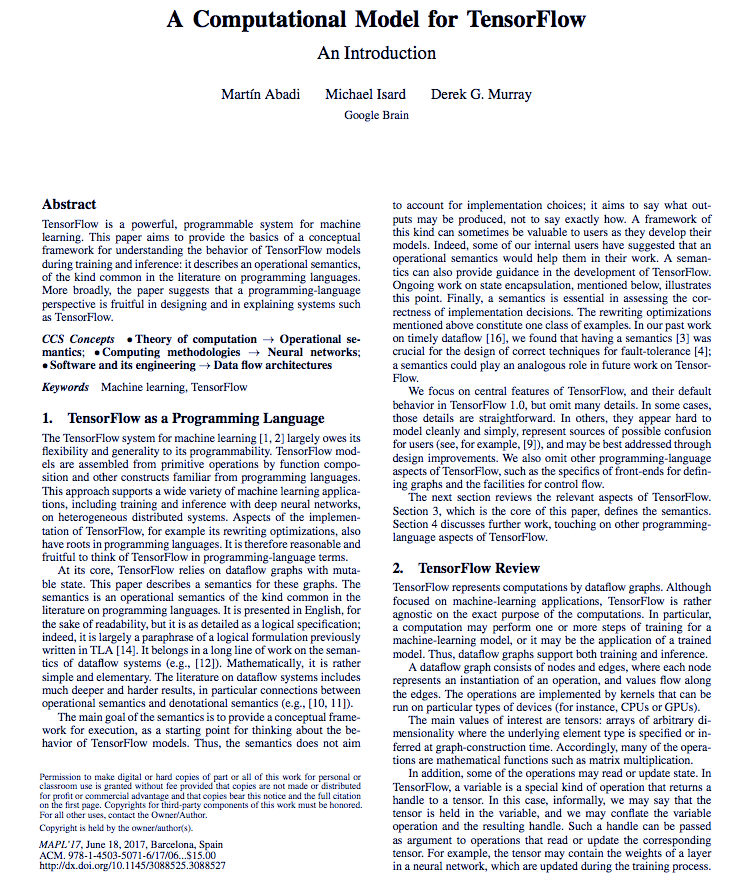
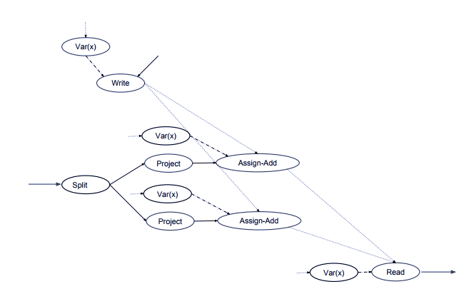
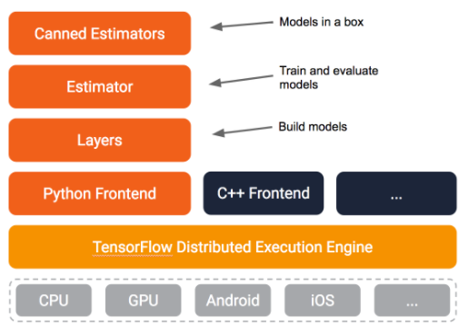
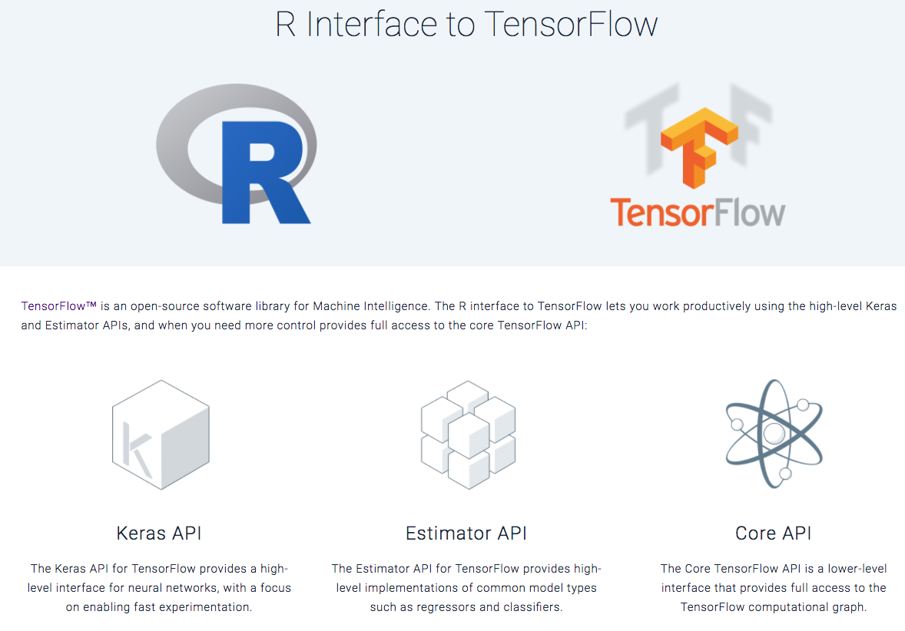

Introduction to Working with Keras and TensorFlow from R
========================================================
author: Joseph B. Rickert
date: 07/15/18
autosize: true

All materials are available at:
https://github.com/joseph-rickert/TokyoR_2018

Inspiration
========================================================


* TensorFlow have emerged as the leading platforms for enterprise level, machine learning applications. 
* Therefore, it ought to be easy to access these platforms from R


TensorFlow
=========================================================

- An open-source library for machine intelligence
- Associated with Deep Learning
- Is a general purpose library for numerical computation 
- Uses data flow graphs.
- Nodes in a `TensorFlow` graph represent mathematical operations
- Data organized as multidimensional data arrays (tensors) that flow along the edges. 
- Edges may also indicate control signals that constrain the order of execution.


TensorFlow Paper
========================================================
This [paper](https://dl.acm.org/citation.cfm?doid=3088525.3088527) from the Google Brain team that developed `TensorFlow` describes the computational model in some detail.




TensorFlow Graph
========================================================



R Interfaces to TensorFlow
========================================================
- Keras API: A high-level interface to neural networks
- Estimators API: A high-level interface to common models including regression and classifiers
- Core API: A low-level interface that provides full access to the TensorFlow computational Graph

Note that these interfaces depend on R's `reticulate` package: 
- When calling into Python, R data types are automatically converted to their equivalent Python types 
- When values are returned to from Python, they are converted back to R types


R Interface to Keras
=========================================================
Package [keras](https://CRAN.R-project.org/package=keras) provides an interface to [keras](https://keras.io/) the `Python` Deep Learning API.

- Supports both convolutional and recurrent neural networks
- Allows same code to run on CPUs or GPUs
- Runs on top of [TensorFlow](https://github.com/tensorflow/tensorflow), [CNTK](https://github.com/Microsoft/cntk), and [Theano](https://github.com/Theano/Theano)

Installing Keras
=========================================================
The first step is to install the CRAN package [keras](https://cran.r-project.org/package=keras). 
- The function `keras::install_keras()` installs both `Keras` and `TensorFlow` on your local machine. 
- The documentation describes how to do a custom installation including how to take advantage of NVIDIA GPUs.  


```r
install.packages("keras")
library(keras)
install_keras()
```


The R Interface to Estimators
========================================================  
Package [tfestimators](https://tensorflow.rstudio.com/tfestimators/):   
- R interface to [Estimators](https://www.tensorflow.org/programmers_guide/estimators) high-level TensorFlow API
- Includes canned models and a framework for building new models.



Canned tfestimators Models
=========================================================
- `linear_regressor()`
- `linear_classifier()`
- `dnn_regressor()`
- `dnn_classifier()`
- `dnn_linear_combined_regresssor()`
- `dnn_linear_combined_classifier()`

More [models](https://tensorflow.rstudio.com/tfestimators/reference/) are coming soon including state saving recurrent neural networks, dynamic recurrent neural networks, support vector machines, random forest, KMeans clustering, etc.

Installing tfestimators
==========================================================
Currently, the `tfestimators`package may be installed from GitHub.    


```r
devtools::install_github("rstudio/tfestimators")
```

If you haven't already installed `TensorFlow` you can do it with the command:

```r
install_tensorflow(version = "1.3.0")
```

The TensorFlow Core API
==========================================================
The [core API](https://www.tensorflow.org/api_docs/python/):
- A set of Python modules
- Enables constructing and executing TensorFlow graphs. 
- The `tensorflow` package provides access to the complete TensorFlow API from within R.

Installing the tensorflow package
===========================================================
To get started, install the tensorflow R package from GitHub.


```r
devtools::install_github("rstudio/tensorflow")
```
Then, use the function `tensorflow::install_tensorflow()` to install TensorFlow:


```r
library(tensorflow)
install_tensorflow()
```

See [Installing TensorFlow](https://tensorflow.rstudio.com/tools/installation.html) to learn about more advanced options, including installing a version of TensorFlow that takes advantage of Nvidia GPUs.


Confirm that TensorFlow is installed
=========================================================
You can confirm that TensorFlow has installed properly by running this code from the console.


```r
library(tensorflow)
sess = tf$Session()
hello <- tf$constant('Hello, TensorFlow!')
sess$run(hello)
```

```
[1] "Hello, TensorFlow!"
```

RStudio Resources for R and TensorFlow
=========================================================
- RStudio has a team committed to making TensorFlow accessible from R
- Go to [tensorflow.rstudio.com](https://tensorflow.rstudio.com/)  

   


