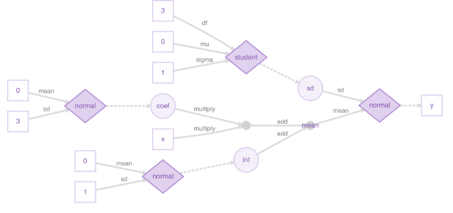

Introduction to Working with TensorFlow from R
========================================================
author: Joseph B. Rickert
date: 07/15/18
autosize: true

All materials are available at:
https://github.com/joseph-rickert/TokyoR_2018

What is TensorFlow?
========================================================
* A platform for enterprise-level data science applications 
* Associated with Deep Learning Neural Nets
* But is much more!!!
* TensorFlow is a machine-independent framework for running high-performance, parallel and distributed algorithms.
* Runs on CPUs, GPUs and other hardware


How does TensorFlow work?
=========================================================

* TensorFlow implements a data flow programming language
* Based on quite a bit of theory and a mathematically defined semantics with provable results (See the TLA+ Language specifying semantics of data flow languages.)
*  Nodes in a TensorFlow graph represent mathematical operations
* Data is organized as multidimensional data arrays (tensors) that flow along the edges of the graph 
* Edges may also indicate control signals that constrain the order of execution.


TensorFlow Graph
========================================================

Dataflow graph of a simple Bayesian Model


TensorFlow Paper
========================================================
This [paper](https://dl.acm.org/citation.cfm?doid=3088525.3088527) from the Google Brain team that developed `TensorFlow` describes the computational model in some detail.


Agenda
========================================================
In this talk, I will:
* Describe the basic R interfaces to TensorFlow
* Show a Deep Learning example (keras API)
* Show a Linear Classifier (tfestimators API)
* Show a Regression example (Core API)


First R Interface to TensorFlow
========================================================
### Keras API 
* [Keras](https://keras.io/) is a high-level interface to neural networks 
* Written in Python
* Allows same code to run on CPUs or GPUs
* Supports convolutional networks (computer vision) & recurrent networks (sequence processing)
* Runs on top of [TensorFlow](https://github.com/tensorflow/tensorflow), [CNTK](https://github.com/Microsoft/cntk), and [Theano](https://github.com/Theano/Theano)
* Accessed through the [`keras`](https://CRAN.R-project.org/package=keras) R package

Second R Interface to TensorFlow
========================================================
### Estimators API   
* [Estimators](https://www.tensorflow.org/programmers_guide/estimators) is high-level TensorFlow API
* Written in Python
* Accessed through the [tfestimators](https://tensorflow.rstudio.com/tfestimators/) R package  
* Includes canned models and a framework for building new models.


Canned tfestimators Models
=========================================================
- `linear_regressor()`
- `linear_classifier()`
- `dnn_regressor()`
- `dnn_classifier()`
- `dnn_linear_combined_regresssor()`
- `dnn_linear_combined_classifier()`

Third R Interface to TensorFlow
========================================================
### Core API
* [The core API](https://www.tensorflow.org/api_docs/python/) is a set of Python modules that enable constructing and executing TensorFlow graphs. 
* Accessed through The [`tensorflow`](https://cran.r-project.org/package=tensorflow) package.

Note that all three interfaces depend on R's `reticulate` package: 
* When calling into Python, R data types are automatically converted to their equivalent Python types 
* When values are returned to from Python, they are converted back to R types


Installing Keras
=========================================================
The first step is to install the CRAN package [keras](https://cran.r-project.org/package=keras). 
- The function `keras::install_keras()` installs both `Keras` and `TensorFlow` on your local machine. 
- The documentation describes how to do a custom installation including how to take advantage of NVIDIA GPUs.  


```r
install.packages("keras")
library(keras)
install_keras()
```


Installing the tensorflow package
===========================================================
To get started, install the tensorflow R package.


```r
install.packages("tensorflow")
```
Then, use the function `tensorflow::install_tensorflow()` to install TensorFlow:


```r
library(tensorflow)
install_tensorflow()
```

See [Installing TensorFlow](https://tensorflow.rstudio.com/tools/installation.html) to learn about more advanced options, including installing a version of TensorFlow that takes advantage of Nvidia GPUs.


Confirm that TensorFlow is installed
=========================================================
You can confirm that TensorFlow has installed properly by running this code from the console.


```r
library(tensorflow)
sess = tf$Session()
hello <- tf$constant('Hello, TensorFlow!')
sess$run(hello)
```

```
[1] "Hello, TensorFlow!"
```

RStudio Resources for R and TensorFlow
=========================================================
- RStudio has a team committed to making TensorFlow accessible from R
- Go to [tensorflow.rstudio.com](https://tensorflow.rstudio.com/)  

   


