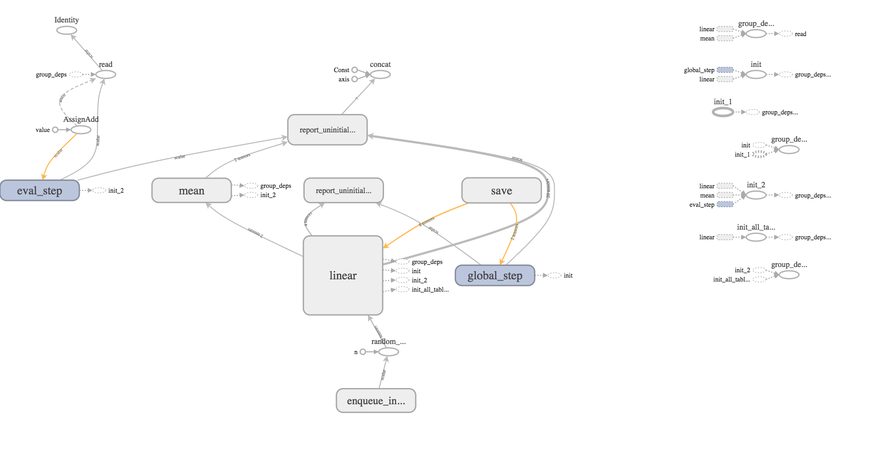

In this notebook, we use functions from the `tfestimators` package and the TensorFlow `Estimator` API to build a linear classifier.

## Prepare the Data

The `titanic_train` dataset from R's titanic package contains 12 fields of information on 891 passengers from the Titanic. In this example we load `titanic_train` into `TensorFlow` and fit a linear classifier model in `TensorFlow` using the function `tfestimators::linear_classifier()`.


```{r}
#devtools::install_github("rstudio/tfestimators")
library(tfestimators)
library(tensorflow)
library(tidyverse)
library(titanic)
head(titanic_train)
```


Load the data into TensorFlow and have a look.
```{r}
titanic_set <- titanic_train %>%
  filter(!is.na(Age))

glimpse(titanic_set)
```

Notice that both `Sex` and `Embarked` are character variables. We would like to make both of these categorical variables for the analysis. This is done with the `tfestimators::feature_columns()` function. Category levels are set by passing a list to the `vocabulary_list argument`. The Pclass variable is passed as a numeric feature, so there no further definition.

```{r}
cols <- feature_columns(
  column_categorical_with_vocabulary_list("Sex", vocabulary_list = 
                                            list("male", "female")),
  column_categorical_with_vocabulary_list("Embarked", vocabulary_list = 
                                            list("S", "C", "Q", "")),
  column_numeric("Pclass")
)
```

## Build the Model

The first step in building the model is to use the `tfestimators::linear_classifier()` function to build the TensorFlow model object. After that, we use the `tfestimators::input_fn()` to define enter the predictive variables and response variable for the classifier. We are trying to predict survival from knowing a passenger's sex, ticket class and port of embarkation. 

```{r}
model <- linear_classifier(feature_columns = cols)

titanic_input_fn <- function(data) {
  input_fn(data, 
           features = c("Sex", "Pclass", "Embarked"), 
           response = "Survived")
}
```

We complete the setup by splitting the data into training and test data sets.

```{r}
indices <- sample(1:nrow(titanic_set), size = 0.80 * nrow(titanic_set))
train <- titanic_set[indices, ]
test  <- titanic_set[-indices, ]
```

## Fit the Model

Here we fit the linear model with the `tfestimators::train()` function that does three things:   
* Fits the model   
* Saves the results to the file system

```{r, warning=FALSE, message=FALSE}
train(model, titanic_input_fn(train))
```

Look at the model files that have been written to disk.
```{r}
list.files(model$estimator$model_dir)
```

Look at the model coefficients.
```{r}
coef(model)
```


## Evaluate the Model   

The `tensorflow::evaluate()` function tests the model’s performance. Note that it will adds a sub-folder called `eval` the model’s folder.

```{r, warning=FALSE, message=FALSE}
model_eval <- evaluate(model, titanic_input_fn(test))
```

Next, we use some `tidyverse` code to format the results of the model.


```{r}
model_eval %>%
  flatten() %>%
  as_tibble() %>%
  glimpse()
```

## Run Predictions with the Model

R's familiar `predict()` function can be used to make predictions, but notice that the `test` data set needs to be wrapped in the `titanic_input_fn()` we wrote above. 

```{r}
model_predict <- predict(model, titanic_input_fn(test))

```

The following code unpacks the list containing the prediction results.
```{r}
res <- data.frame(matrix(unlist(model_predict[[1]]),ncol=2,byrow=TRUE), 
                  unlist(model_predict[[2]]), unlist(model_predict[[3]]), 
                  unlist(model_predict[[4]]), unlist(model_predict[[5]]))
names(res) <- c("Prob Survive", "Prob Perish",names(model_predict)[2:5])
head(res)


```

## TensorBoard
Finally, use the [TensorBoard](https://www.tensorflow.org/get_started/summaries_and_tensorboard) visualization tool to look at the model.

```{r, warning=FALSE, message=FALSE}
tensorboard(model$estimator$model_dir, launch_browser = TRUE)
```

Here, is the flow graph for the model calculations.



