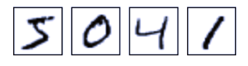
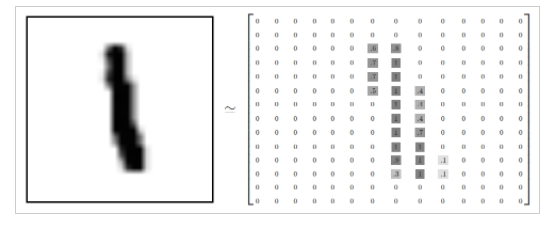
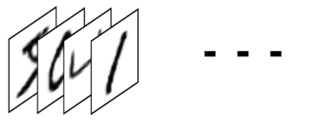

## Keras
[Keras](https://keras.io/) is a high-level neural networks API, written in Python and capable of running on top of [TensorFlow](https://github.com/tensorflow/tensorflow), [CNTK](https://github.com/Microsoft/cntk), or [Theano](https://github.com/Theano/Theano) written in Python. Additional features of Keras are that it:

* Allows the same code to run on CPU or on GPU, seamlessly
* Provides an API that makes it relatively easy to prototype deep learning models   
* Has support built-in for combinations of convolutional networks (for computer vision) and recurrent networks (for sequence processing)    
* Supports arbitrary network architectures: multi-input or multi-output models, layer sharing, model sharing, etc. 

This last point means that Keras is appropriate for building deep learning model that rage in complexity from a memory network to a neural Turing machine.

## The MNIST Example
The following example is adapted from the `keras` package online [documantation](https://keras.rstudio.com/).

### Installing Keras and TensorFlow
The first step is to install R package [keras](https://cran.r-project.org/package=keras) from CRAN. The `install_keras()` function installs both `Keras` and `TensorFlow` on your local machine. The documentation for `install_keras` describes how to do a custom installation including how to take advantage of NVIDIA GPUs.
```{r,eval=FALSE}
install.packages("keras")
library(keras)
install_keras()
```

### Load and organize the data
Next, we load the [MNIST](https://en.wikipedia.org/wiki/MNIST_database) data set of 60,000 28x28 grayscale images of the 10 digits, along with a test set of 10,000 images. This data set, which is used to train image processing systems is included in the `keras` package. A typical MNIST grayscale image looks something like this:



The data set also includes labels for each image, telling us which digit it is. For example, the labels for the above images are 5, 0, 4, and 1. Each image is 28 pixels by 28 pixels and is stored as an array of numbers.



The `str()` functions shows how the MNIST data set is organized.

```{r, message=FALSE}
library(keras)
mnist <- dataset_mnist()
str(mnist,give.attr = FALSE)
```    

Here, we organize the data for conveniently feeding it to `TensorFlow`.

```{r}    
x_train <- mnist$train$x
y_train <- mnist$train$y
x_test <- mnist$test$x
y_test <- mnist$test$y
```

The x data is a 3-d array (images,width,height) of grayscale values. To prepare the data for training we convert the 3-d arrays into matrices by reshaping width and height into a single dimension (28x28 images are flattened into length 784 vectors). Then, we convert the grayscale values from integers ranging between 0 to 255 into floating point values ranging between 0 and 1. The y data is an integer vector with values ranging from 0 to 9. To prepare this data for training we [one-hot encode](https://www.quora.com/What-is-one-hot-encoding-and-when-is-it-used-in-data-science) the vectors into binary class matrices using the function `keras::to_categorical()`.

```{r}
# reshape
dim(x_train) <- c(nrow(x_train), 784)
dim(x_test) <- c(nrow(x_test), 784)
# rescale
x_train <- x_train / 255
x_test <- x_test / 255

y_train <- to_categorical(y_train, 10)
y_test <- to_categorical(y_test, 10)

dim(x_train)
```

The result is that both x_train and x_test are `tensors` of `shape` (60000L, 784L). Each row represents a flat version of the 28 pixel by 28 pixel image. 



### Define the model

In Keras, data is organized into layers. The core data structure, which is a collection of layers, is called a model. The simplest type of model is the sequential model which is a linear stack of layers.

We begin by creating a sequential model using the sequential model constructor `keras_model_sequential` and then adding layers using the pipe `%>%` operator and various functions to describe the layers. 

* `layer_dense()` adds a densely-connected NN layer. 
* The `units` argument defines the dimension of the output space. 
* `activation` = "relu" indicates that nodes in this layer will be [activated](https://en.wikipedia.org/wiki/Activation_function) as **rectified linear units** [ReLU](https://en.wikipedia.org/wiki/Rectifier_(neural_networks)). 
* `input_shape` specifies the dimensionality of the input. 
* 784 is the length of the grayscale image. 
* Specifying a `layer_dropout()` rate of 0.4 means that 40% of the units will randomly be set to 0 during the training. This is a technique to prevent overfitting. 

The final layer outputs a length 10 numeric vector (probabilities for each digit) using a [softmax activation](https://en.wikipedia.org/wiki/Softmax_function) function. Look [here](https://github.com/Kulbear/deep-learning-nano-foundation/wiki/ReLU-and-Softmax-Activation-Functions) for a nice summary of the `relu` and `softmax` actvation functions.

```{r}
model <- keras_model_sequential() 
model %>% 
  layer_dense(units = 256, activation = "relu", input_shape = c(784)) %>% 
  layer_dropout(rate = 0.4) %>% 
  layer_dense(units = 128, activation = "relu") %>%
  layer_dropout(rate = 0.3) %>%
  layer_dense(units = 10, activation = "softmax")
```  
Softmax regression is a natural model for problems where the goal is to assign probabilities to an object being one of several different things because it gives us a list of values between 0 and 1 that add up to 1. 

A softmax regression has two steps: first add up the evidence of our input being in certain classes, and then convert that evidence into probabilities. The process may be envisioned something like this:


The summary method provides a description of the model.
```{r}
summary(model)
```
The 200,960 parameters in the first layer comes from (784 inputs) * (256 neurons) + (256 bias values).

Before training a keras model you need to configure the learning process. This done with the [`compile`](https://faroit.github.io/keras-docs/1.0.1/getting-started/sequential-model-guide/) function. 

* `loss` specifies the loss function that the model will attempt to minimize. 
* `optimizer` specifies the optimization algorithm to be used. In this case, we use the [remsprop](http://climin.readthedocs.io/en/latest/rmsprop.html) optimizer which uses the magnitude of recent gradients to normalize gradients. The [keras documentation](https://keras.io/optimizers/) suggests that this is usually a good choice for recurrent neural networks. Look [here](https://www.tensorflow.org/api_docs/python/tf/metrics/accuracy) to see how `TensorFlow` calculates accuracy.

```{r}
model %>% compile(
  loss = "categorical_crossentropy",
  optimizer = optimizer_rmsprop(),
  metrics = c("accuracy")
)
```

Next we fit the model for 30 epochs using batches of 128 images and specifying that 20% of the training data will be used for validation.
```{r}
history <- model %>% fit(
  x_train, y_train, 
  epochs = 30, batch_size = 128, 
  validation_split = 0.2
)
```

The model fit which we have saved in the object `history` contains a good deal of information.

```{r}
str(history)
```

## Plot the Training Results

The plot method for model fit object plots accuracy and loss for both the training and validation data of the 30 epochs of training.
```{r}
plot(history)
```
This information can be used to evaluate the models performance.
```{r}
model %>% evaluate(x_test, y_test,verbose = 0)
```

## Predict with New Data
Finally, we demonstrate hos the `predict_classes()` function can be used to generate predictions for new data.
```{r}
model %>% predict_classes(x_test)
```

For more information see the [blog post](https://blog.rstudio.com/2017/09/05/keras-for-r/) on which document is based by J.J. Allaire, the primary author of the `keras` package; [The Guide to the Sequential Model](https://keras.rstudio.com/articles/sequential_model.html), and the [vignettes](https://CRAN.R-project.org/package=keras) for `keras`.


